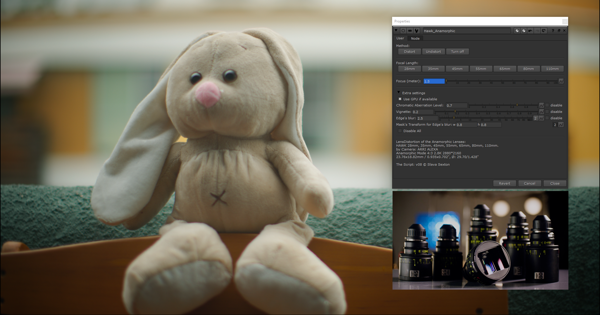
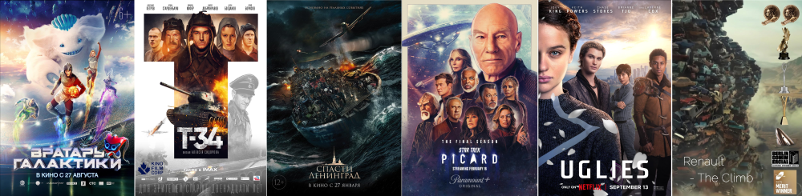
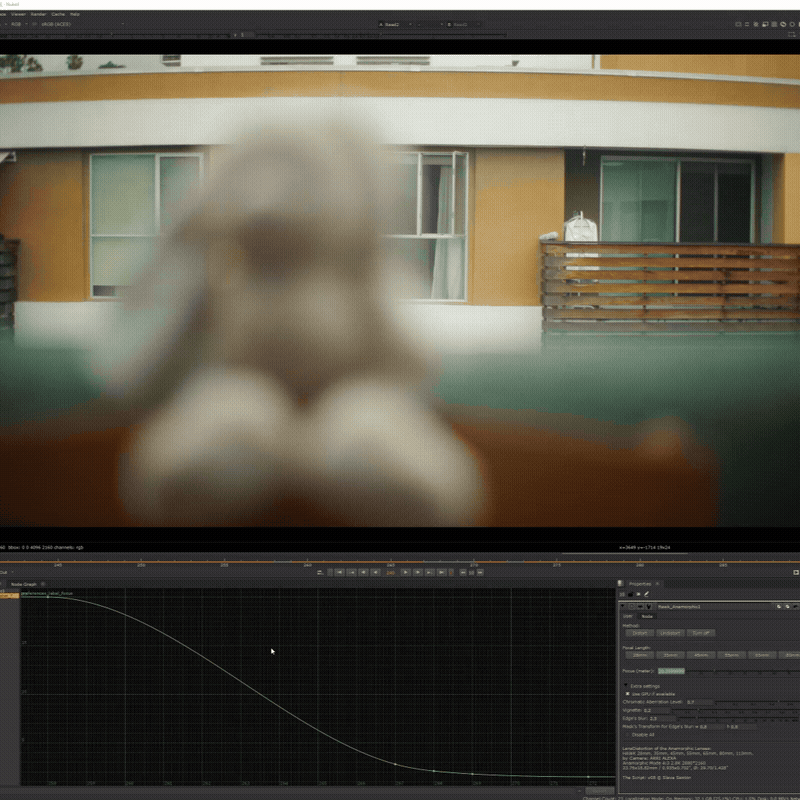
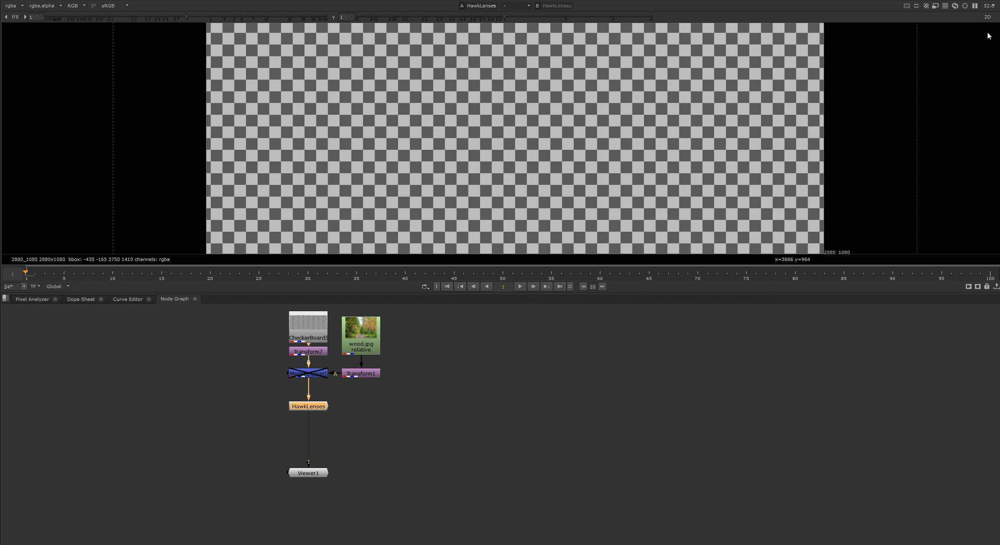

# Hawk_Anamorphic - Nuke Gizmo

Adds natural HAWK anamorphic lens character to CG and AI-generated footage.



Hawk_Anamorphic recreates the optical behavior of HAWK anamorphic lenses (28mm, 35mm, 45mm, 55mm, 65mm, 80mm, 110mm), based on data captured with an ARRI ALEXA in Open Gate / 4:3 anamorphic mode (2880×2160).

The gizmo covers the optical characteristics that matter most on real anamorphic glass:

- Focus breathing 
- Edge blur and softness falloff  
- Chromatic aberration  
- Vignetting  

Use it as the final step after your depth-of-field node (ZDefocus, OpticalZDefocus, etc.).

---

## Used in Production



---

## Demo





**Video:** [Watch on Vimeo](https://vimeo.com/1186615428)

---

## Lens Data

| Focal Length | Camera | Mode | Resolution | Sensor |
|---|---|---|---|---|
| 28mm, 35mm, 45mm, 55mm, 65mm, 80mm, 110mm | ARRI ALEXA | Anamorphic Mode 4:3 (2.8K) | 2880×2160 | 23.76×18.82mm / 0.935×0.702" · Ø 29.70mm / 1.428" |

---

## Requirements

Requires the 3DEqualizer lens distortion nodes for Nuke.  
Download: [3DE4 Lens Distortion Plugin](https://www.3dequalizer.com/?site=tech_docs&id=110216_01)

---

## Installation

Create a `gizmos` folder inside your `.nuke` directory if you don't have one, then drop `Hawk_Anamorphic.gizmo` into it.

Add this line to your `init.py`:

```python
nuke.pluginAddPath('./gizmos')
```

Restart Nuke - the node will be available via the Tab menu.

## Usage note

Make sure the node is connected within your node graph so it can read the input format and adjust automatically. Running it disconnected will produce incorrect results.
Animate the Focus parameter (in meters) to reproduce natural lens breathing.

## Background

Originally developed during the production of T-34, this tool was later used across feature films, television series, and commercial projects - including an award-winning campaign recognized with Cannes Lions Gold, LIA Gold, and a Clio Award.
**T-34 VFX Breakdown** - the project this gizmo was originally built for. The film was shot on HAWK anamorphic lenses. All CG shots, especially full CG, had to be consistent with that - to look as if they were captured through the same glass: [Watch on Vimeo](https://vimeo.com/519778121)

## Credits

Gizmo by Slava Sexton · [IMDB](https://imdb.me/sexton) · [LinkedIn](https://linkedin.com/in/slavasexton)

*Demo footage shot specifically for this release by Damon Bogdanov.*

## License

MIT License · Free to use for personal and commercial projects.
